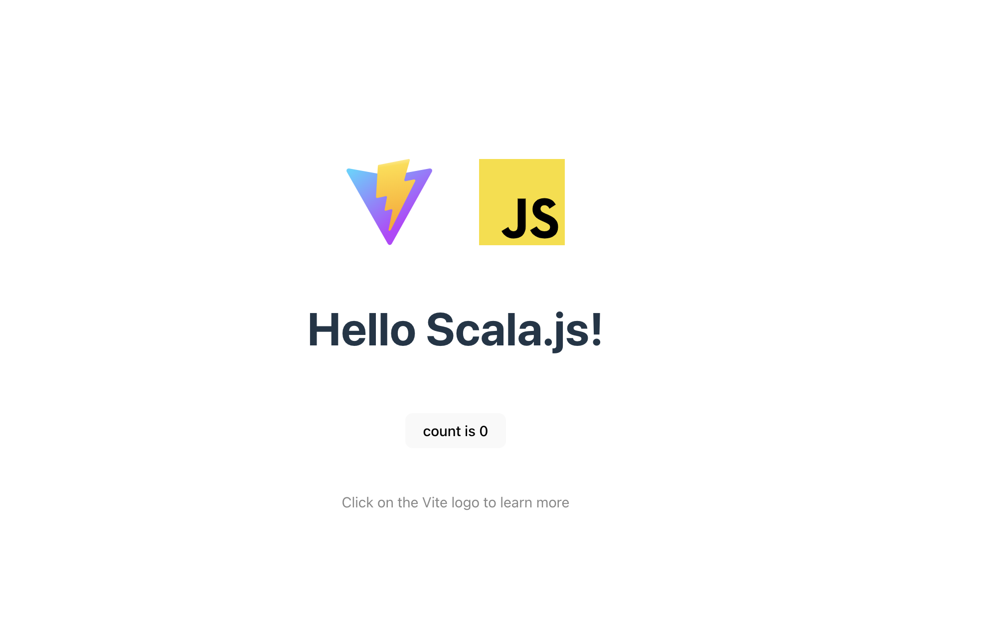

# Scala.js with Vite Starter

This repository offers a minimal setup for developing Scala.js projects using Vite as the build tool.  
It is aimed at developers looking to quickly bootstrap a new Scala.js project.

## Features

- **Scala.js Integration:** Utilize Scala's type-safe language features to build your front-end projects.
- **Vite-Powered Development:** Enjoy Vite's fast build times and instant hot module replacement for a seamless development experience.
- **Ready-to-Extend Template:** A clean project structure that's easy to understand and ready to be scaled with your application's needs.

## Getting Started

To get started with this project, ensure you have [Node.js](https://nodejs.org/) and [sbt](https://www.scala-sbt.org/) installed on your machine.
This project has been built with:
- sbt: 1.9.9
- Java 17

### Setup

1. Clone this repository:

```bash
git clone https://github.com/yourusername/scala-js-vite-starter.git
cd scala-js-vite-starter
```

2. Install JavaScript dependencies
```bash
npm install
```

3. Run vite
```bash
npm run dev
```

4. Run sbt for transpilation to JavaScript
```bash
npm run scala-to-js
```

